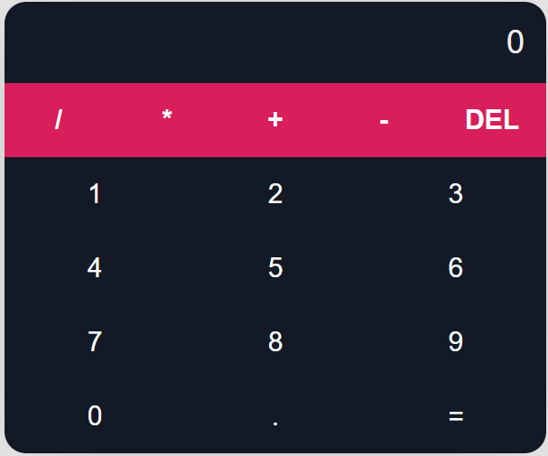
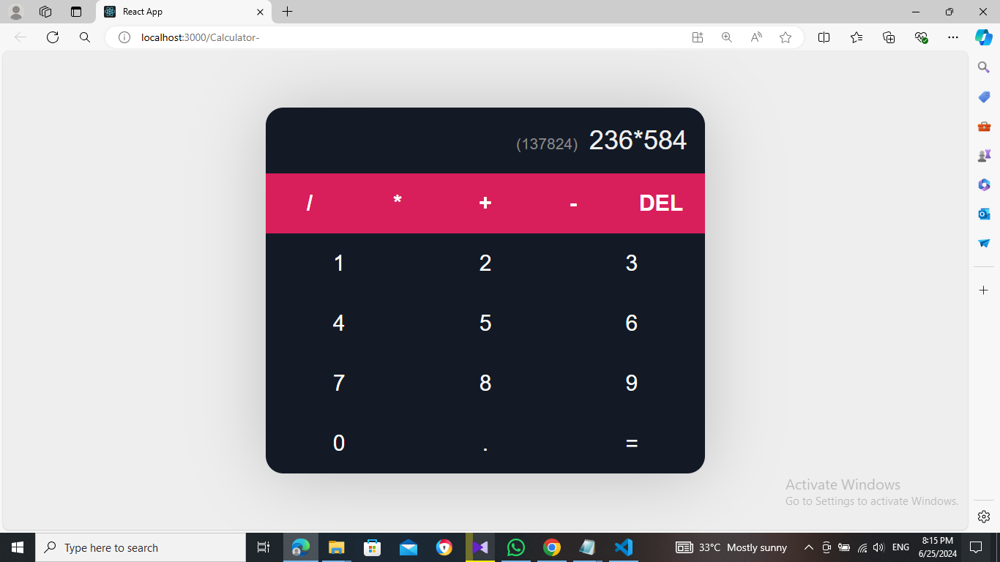

# React Calculator



A simple calculator built with React. This project uses HTML, CSS, and JavaScript to create a functional calculator that performs basic arithmetic operations.

## Table of Contents

- [Project Description](#project-description)
- [Features](#features)
- [Installation](#installation)
- [Usage](#usage)
- [Screenshots](#screenshots)
- [Contributing](#contributing)
- [License](#license)
- [Acknowledgements](#acknowledgements)

## Project Description

The React Calculator is a basic calculator application that allows users to perform simple arithmetic operations such as addition, subtraction, multiplication, and division. The project is built using React and showcases the use of components, state, and event handling in React.

## Features

- Addition, subtraction, multiplication, and division
- Clear and delete functionality
- Responsive design
- Keyboard support

## Installation

To get a local copy up and running, follow these steps:

1. **Clone the repository**:
    ```bash
    git clone https://github.com/<username>/react-calculator.git
    cd react-calculator
    ```

2. **Install dependencies**:
    ```bash
    npm install
    ```

3. **Start the development server**:
    ```bash
    npm start
    ```

## Usage

Once the development server is running, you can access the calculator in your web browser at `http://localhost:3000`. Use the calculator by clicking the buttons or using your keyboard.

## Screenshots




## Contributing

Contributions are what make the open-source community such an amazing place to be, learn, inspire, and create. Any contributions you make are **greatly appreciated**.

1. Fork the Project
2. Create your Feature Branch (`git checkout -b feature/AmazingFeature`)
3. Commit your Changes (`git commit -m 'Add some AmazingFeature'`)
4. Push to the Branch (`git push origin feature/AmazingFeature`)
5. Open a Pull Request

## License

Distributed under the MIT License. See `LICENSE` for more information.

## Acknowledgements

- [React](https://reactjs.org/)
- [Create React App](https://create-react-app.dev/)
- [GitHub Pages](https://pages.github.com/)
